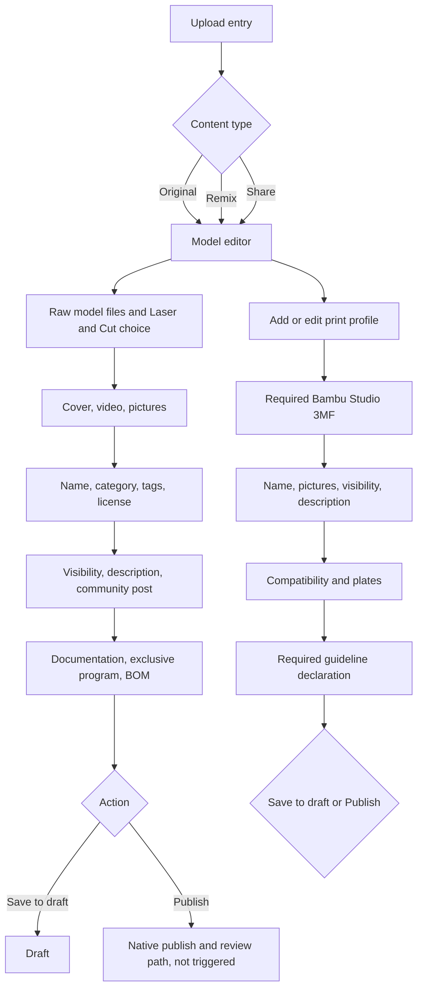
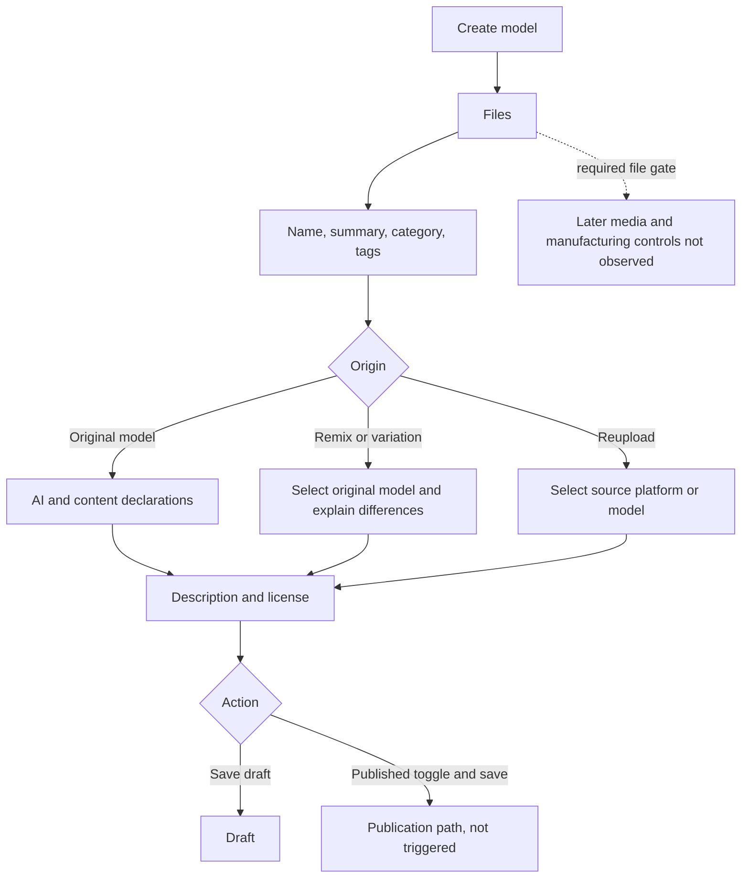
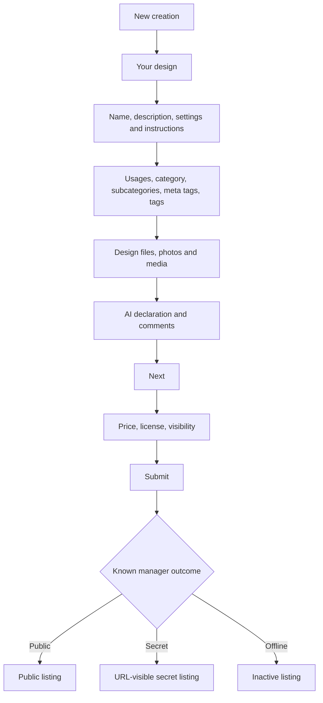
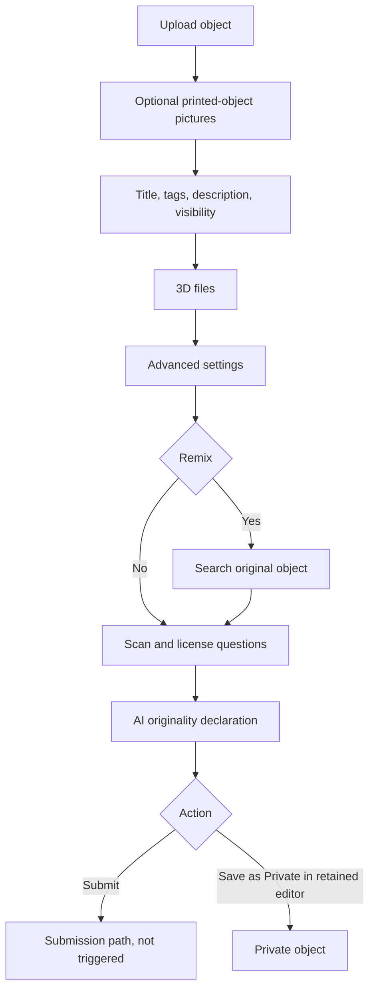
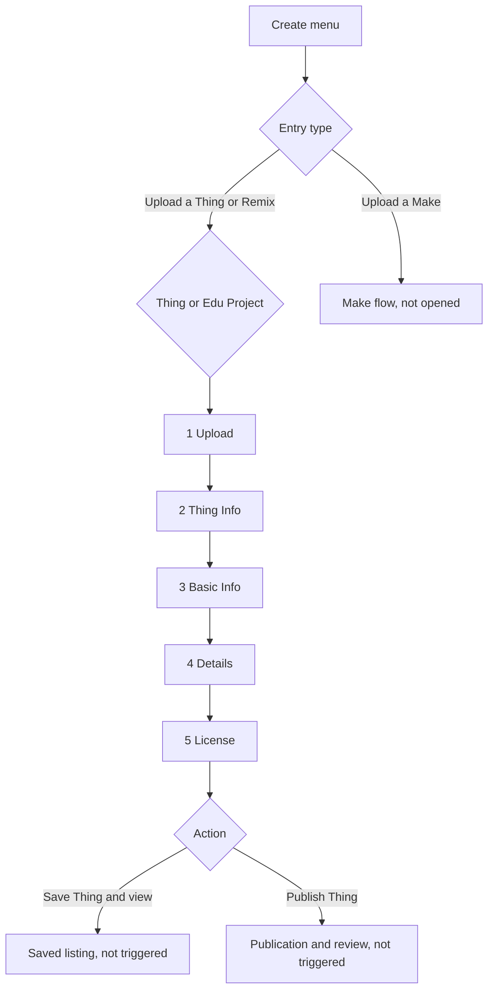
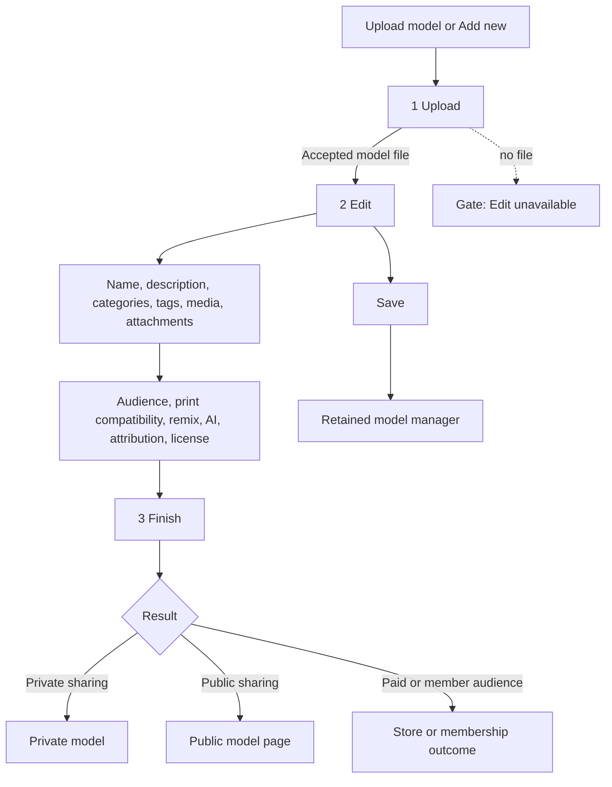
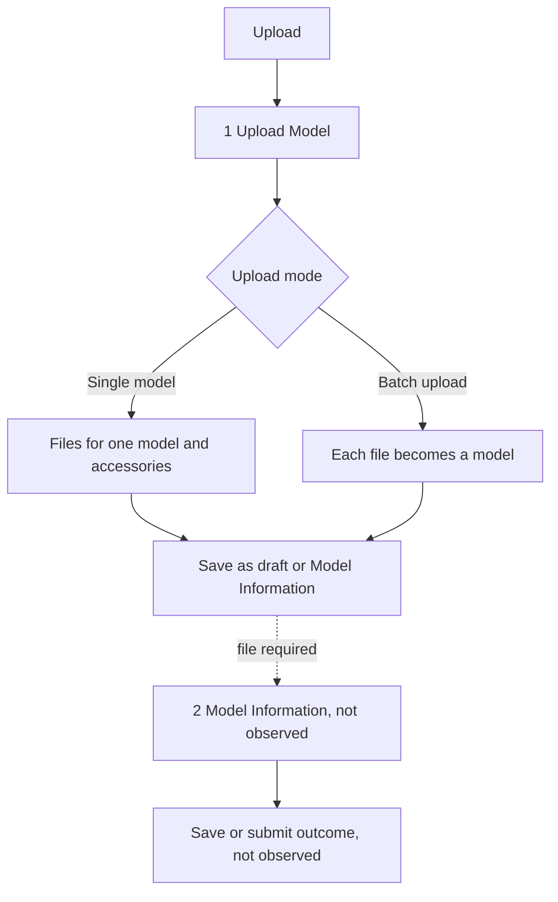
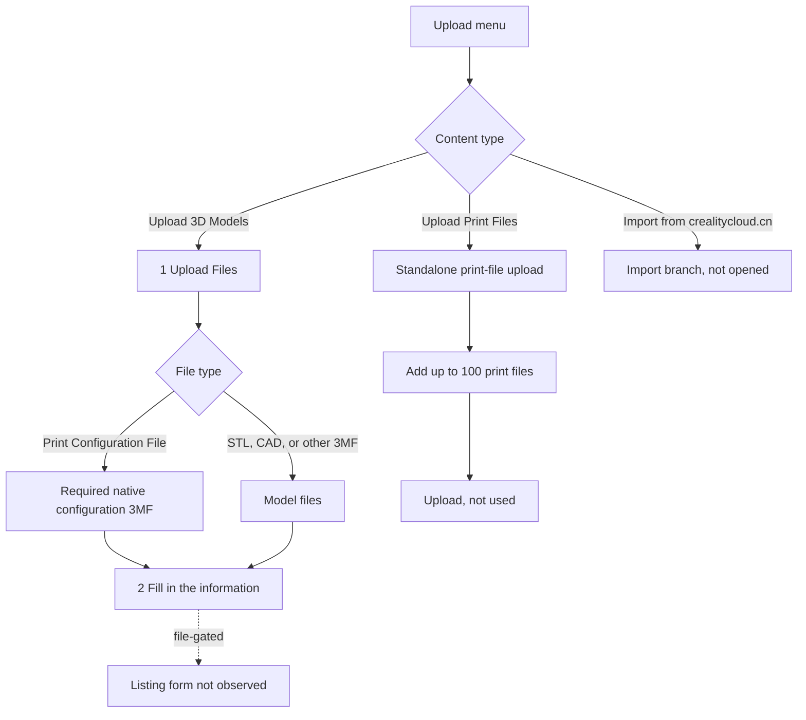
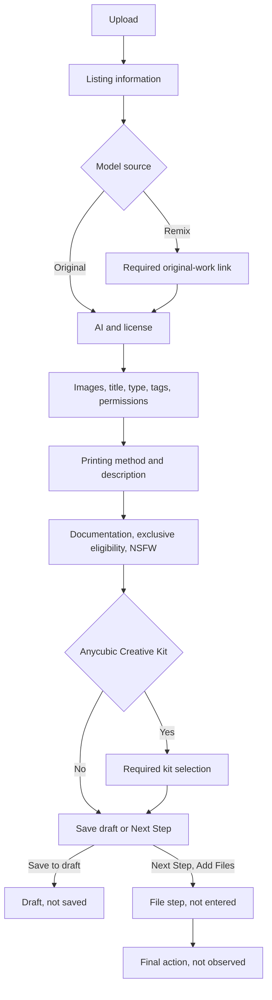
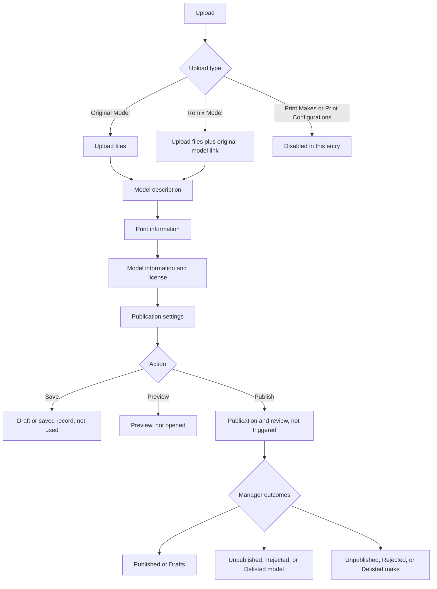

# Independent native upload-flow audit

Audit date. 2026-08-22

## Audit method

I inspected the signed-in Chrome interfaces for ten platforms using accessibility trees and screenshots from the native pages. I began with no repository documentation, source code, memory, or earlier audit report. I did not compare the controls with ModelPrep or propose mappings.

The inspection was read-only. I opened menus, category trees, retained editors, and harmless unsaved conditionals. I did not choose a local file, upload data, save a draft, publish, submit, accept terms, change account settings, or delete anything. When a system file picker opened while testing an attachment control, I cancelled it without selecting a file. When Thingiverse warned that local unsaved inspection changes would be lost, I chose `Leave`. No server-side draft was changed.

Required status terms in this report:

- **Observed** means the native control and its current state were visible.
- **Retained editor** means the control was visible on an existing listing without saving changes.
- **File-gated** means the next native step required a file and no retained editor was available.
- **Not proven** means the native page did not establish the detail. No value is inferred from another platform or from product code.

### Completeness by platform

| Platform | Status | Strongest evidence | Main boundary |
|---|---|---|---|
| MakerWorld | High | New model form, retained model editor, retained print-profile editor | Publish review result was not triggered |
| Printables | Partial | Full pre-file creation form | Later media and manufacturing controls were file-gated |
| Cults3D | High | New design form, retained editor, price and license step, design manager | Submission and moderation were not triggered |
| MyMiniFactory | High | New object form and retained editor | Full unselected category taxonomy was not enumerated |
| Thingiverse | High | Complete five-part form with local conditionals | No upload, save, or publication review |
| Thangs | High | New three-step upload gate and retained model editor | New step 2 and step 3 were not traversed with a new file |
| Nexprint | Partial | Step 1, upload-mode branches, profile and creator state | `Model Information` was file-gated and the account had no retained model |
| Creality Cloud | Partial | Native upload menu, model-file step, print-file branch | `Fill in the information` was file-gated |
| MakerOnline | High for step 1 | Full listing-information page and conditional controls | `Next Step, Add Files` was not entered |
| MakerRoad | High | Full single-page upload form and review-status manager | No file was selected and no save, preview, or publish action was used |

### Native copy terms

No inspected form exposed a field labeled `Subtitle`. The exact native naming observed for the requested copy areas is:

| Platform | Identity and short copy | Long copy and instructions |
|---|---|---|
| MakerWorld | `Model Name`, `Print Profile Name` | `Description`, `Print Profile Description`, `Add Documentation`, `Assembly Guide and Other files` |
| Printables | `Model name`, `Summary` | `Description`, `Differences of the remix compared to the original (required)` |
| Cults3D | `Name` | `3D model description`, `Settings and manufacturing instructions` |
| MyMiniFactory | `Design Title` | `Description`, `Printing tips` |
| Thingiverse | `Name`, `Summary` | `Add Notes`, `Post Printing`, `How I Designed This`, `Custom Section`, block-level `Title` and `Notes` |
| Thangs | `Model Name *` | `Description`, `Attachments`, `Inspiration and attribution` |
| Nexprint | No listing-copy fields before the file gate | `Model Information` was file-gated |
| Creality Cloud | No listing-copy fields before the file gate | `Fill in the information` was file-gated |
| MakerOnline | `Model Title` | `Model Description`, `Documentation` |
| MakerRoad | `Title` | `Model Description`, `Instructions Text` |

## MakerWorld

Inspected URLs:

- `https://makerworld.com/en/my/models/2831314/edit`
- `https://makerworld.com/en/my/profiles/3154793/edit`
- `https://makerworld.com/en/models/2831314-microphone-shure-a1k-style-anti-roll-ring-37mm#profileId-3154793`

### Journey

### Native sections and controls

| Order | Section | Exact control | Type and options | Default, requirement, and behavior |
|---:|---|---|---|---|
| 1 | Source | `Original`, `Remix`, `Share` | Radio group | `Original` selected in retained editor. The source type was locked there. |
| 2 | Files | `Raw Model Files` | Multi-file upload with `Browse` and `New folder` | Accepted formats shown: `3ds, amf, dwg, dxf, f3d, factory, fcstd, iges, ipt, obj, ply, rsdoc, scad, shape, shapr, skp, sldasm, sldprt, slvs, step, stl, stp, studio3, zip, 3mf, stpz`. Open-source selection affects whether users can download raw files. Uploading a STEP-like original separately is recommended for cloud slicing while protecting the original design. |
| 3 | Laser | `Does this model include a Laser & Cut model?` | Required Yes or No | `No` selected. Yes reads `I want to link a Laser & Cut model`. The linked branch was not opened. |
| 4 | Covers | `Model Covers` | Image upload | `jpg/gif/png`, at most 30 MB. Real print photos requested. Required Web/App cover uses 4:3. App cover uses 3:4 and is described as larger in the app. |
| 5 | Video | `Model Videos` | Video upload | Maximum 30 seconds. `mp4/mov` recommended. The video appears first on the model detail page. |
| 6 | Gallery | `Model Pictures` | Ordered image gallery with add, select, and reorder | Current retained count was `14/16`. `png/jpg/webp/gif`, at most 30 MB each. 4:3 recommended. Printed-model photos requested. |
| 7 | Identity | `Model Name` | Text | Required, maximum 50 characters. Retained value showed `48/50`. |
| 8 | Taxonomy | `Category` | Searchable tree, one selected leaf | Required. The observed tree is listed below. |
| 9 | Discovery | `Tags` | Token input | Up to 50 tags. Each input showed a `0/100` counter. Enter separates tags. Similar-tag suggestions are intended to improve discovery. |
| 10 | Rights | Adaptations question | Radio group | Options: `Yes`; `Yes, as long as they share alike`; `Yes, derivatives exclusively on MakerWorld`; `Yes, derivatives exclusively on MakerWorld and SDFL-C`; `No`. Exact long labels were visually abbreviated in places, so this wording is the visible semantic text. |
| 11 | Rights | Commercial-use question | Yes or No | Required. |
| 12 | Rights | Sharing or redistribution question | Yes or No | Required. These answers compute a disabled license selector. A visible result was `Standard Digital File License`. |
| 13 | Audience | `Visibility` | `Public`, `Private` | Required. |
| 14 | Copy | `Description` | Rich-text editor | Required. Tools observed: headings, clear format, bold, italic, underline, color, alignment, link, lists, indent, quote, table, image, media embed, undo, redo, find and replace, `Boost Me`, and `Membership`. A creator setting can supply a shared header or footer. |
| 15 | Community | `Community Post` | Checkbox | Optional. |
| 16 | Documentation | `Add Documentation` | File or section add control | Optional. Helper: `Assembly Guide and Other files`. Accepted formats and limits were not exposed before activation. |
| 17 | Exclusive | `Exclusive Model`, `14-Day Exclusive Launch Model` | Checkbox and program choice | Optional and account-program related. Participation refers to `Exclusive Model Guidelines` and the `Exclusive Model Program Agreement`. |
| 18 | BOM | BOM enable control | Conditional structured editor | Optional. Opens `Kits and Parts by Product ID`, `Filaments`, `Materials`, and `List other parts`. Each section has an add action. An existing filament row exposed quantity and product link or SKU. A helper warned when quantity equaled `0 pcs`. |
| 19 | Actions | `Save to draft`, `Publish` | Buttons | No action was used. |

### Category tree

- `3D Printer`: `3D Printer Accessories`, `3D Printer Parts`, `Test Models`.
- `Art`: `2D Art`, `Coin & Badges`, `Signs & Logos`, `Sculptures`, `Other Art Models`.
- `Education`: `Biology`, `Chemistry`, `Engineering`, `Geography`, `Mathematics`, `Physics & Astronomy`, `Other Education Models`.
- `Fashion`: `Bags`, `Clothes`, `Earrings`, `Footwear`, `Glasses`, `Jewelry`, `Rings`, `Other Fashion Models`.
- `Hobby & DIY`: `Electronics`, `Music`, `RC`, `Robotics`, `Sport & Outdoors`, `Vehicles`, `Other Hobby & DIY`.
- `Household`: `Decor`, `Festivities`, `Garden`, `Office`, `Pets`, `Other House Models`.
- `Miniatures`: `Animals`, `Architecture`, `Creatures`, `People`, `Other Miniatures`.
- `Props & Cosplays`: `Costumes`, `Masks & Helmets`, `Cosplay Weapons`, `Other Props & Cosplays`.
- `Tools`: `Gadgets`, `Hand Tools`, `Machine Tools`, `Measure Tools`, `Medical Tools`, `Organizers`, `Other Tools`.
- `Toys & Games`: `Board Games`, `Characters`, `Outdoor Toys`, `Puzzles`, `Construction Sets`, `Other Toys & Games`.
- `Generative 3D Model`: `Hueforge & Lithophane`, `Make My Sign`, `Make My Vase`, `Pixel Puzzle Maker`, `Relief Sculpture Maker`, `AI Scanner`, `Image to Keychain`, `Make My Desk Organizer`, `PrintMon Maker`, `Statue Maker`, `Christmas Ornament Maker`, `Make My Lantern`.

### Print-profile editor

| Order | Exact control | Type and options | Requirement and behavior |
|---:|---|---|---|
| 1 | `Bambu Studio File (Print Profile)` | File replacement | Required 3MF. Helper defines it as a print profile used to generate G-code. |
| 2 | `Print Profile Name` | Text | Required, maximum 60. Helper asks for the main difference from existing profiles. |
| 3 | `Print Profile Pictures` | Ordered image gallery | Required. Retained count `6/37`. At least one photo of the printed model is required, with a warning that the profile may be taken down otherwise. One image is marked cover. |
| 4 | `Visibility` | `Public`, `Private` | Required. |
| 5 | `Print Profile Description` | Rich text | Optional. |
| 6 | `Printer Compatibility Check` | Automatic result with selectable printers | The system checks the uploaded profile. It warns that `Print by Object` can limit printers. Visible choices were `P1S` selected and disabled, plus `X1 Carbon`, `X1`, `X1E`, `P1P`, `P2S`, `A1 mini`, `A1`, `H2C`, `H2D`, `H2D Pro`, `H2S`, `X2D`, `A2L`. |
| 7 | `Print Plates` | Plate list | Retained count was 1. |
| 8 | `I've read Print Profile Guidelines and be sure my print profile meets the requirement.` | Checkbox | Required and checked in the retained editor. |
| 9 | `Save to draft`, `Publish` | Buttons | Not used. |

### Minimum-success checklist

Visible required marks or explicit native statements:

- Select a source type for a new model.
- Supply accepted raw model content.
- Answer the Laser and Cut question.
- Supply required covers and model pictures, including the stated cover ratios.
- Enter `Model Name`, select a category leaf, answer the three license questions, select visibility, and enter `Description`.
- For a print profile, supply a Bambu Studio 3MF, profile name, at least one real printed-model photo, visibility, and the checked guidelines declaration.

Inferred gating, kept separate:

- `Publish` likely validates the marked listing fields. I did not press it, so the exact error order and review outcome are not proven.
- Exclusive and BOM controls are conditional, not minimum requirements for a normal upload.

## Printables

Inspected URL: `https://printables.com/model/create`

### Journey

### Native sections and controls

| Order | Exact control | Type and options | Default, requirement, and behavior |
|---:|---|---|---|
| 1 | `DRAFT`, `PUBLISHED` | State selector | `DRAFT` was the creation state. `Close` and `SAVE DRAFT` were also visible. No save was used. |
| 2 | Files | Drag or browse multi-file upload | Tip says multiple files may be bundled as one ZIP. Accepted formats: `.3dm, .3ds, .3dxml, .3mf, .ai, .amf, .asm, .bgcode, .blend, .cdr, .csv, .ctb, .dwg, .dxf, .easm, .f3d, .f3z, .factory, .fcstd, .gcode, .gif, .heic, .heif, .iges, .igs, .ini, .ino, .ipt, .jpeg, .jpg, .lys, .lyt, .obj, .par, .pdf, .ply, .png, .prt, .py, .rsdoc, .scad, .shape, .shapr, .skp, .sl1, .sl1s, .sldasm, .sldprt, .slvs, .step, .stl, .stp, .studio3, .svg, .txt, .webp, .zip, .zpr`. No count or size limit was shown. |
| 3 | `Model name` | Text | Required. Placeholder: `Descriptive names are better`. No visible count. |
| 4 | `Summary` | Text | Required, maximum 120 characters. |
| 5 | `Main category` | Single tree selection | Required. Two-level taxonomy listed below. |
| 6 | `Additional tags` | Token input | Optional. Helper says to use spaces. A limit was not visible. |
| 7 | `Model origin` | `Original model`, `Remix or variation`, `Reupload` | Original says `I made it` and `upload new model`. Remix opens `Original models used in this remix` URL or search autosuggest. After a source is selected, `Differences of the remix compared to the original (required)` is expected. Reupload opens `Where do you reupload the models from?` and notes that reuploads do not earn Prusameter points. |
| 8 | AI question | `Yes, assisted`, `No, human` | Required. A warning says incorrect labeling may cause removal. |
| 9 | NSFW | Checkbox | Covers nudity, violence, profanity, political statements, or disturbing content. |
| 10 | `Political Content` | Checkbox | Optional declaration. |
| 11 | `Description` | Rich editor | Tools include formatting, links, image, table, YouTube or Vimeo, inline code, code block, lists, and quote. Requirement was not proven before a file. |
| 12 | `License` | Select | Required. Full visible list appears below. |

### Main-category taxonomy

- `3D Printers`: `Prusa Parts & Upgrades`, `Accessories`, `Anycubic Parts & Upgrades`, `Bambu Lab Parts & Upgrades`, `Creality Parts & Upgrades`, `Other Printer Parts & Upgrades`, `Voron Parts & Upgrades`, `Test Models`.
- `Art & Design`: `2D Plates & Logos`, `Sculptures`, `Wall-mounted`, `Other Art & Designs`.
- `Costumes & Accessories`: `Cosplay & Costumes in general`, `Masks`, `Props`, `Other Costume Accessories`.
- `Fashion`: `Men`, `Women`, `Other Fashion Accessories`.
- `Gadgets`: `Audio`, `Computers`, `Photo & Video`, `Portable Devices`, `Video Games`, `Virtual Reality`, `Other Gadgets`.
- `Healthcare`: `Home Medical Tools`, `Medical Tools`.
- `Hobby & Makers`: `Automotive`, `Electronics`, `Mechanical Parts`, `Music`, `Organizers`, `RC & Robotics`, `Tools`, `Other Ideas`.
- `Household`: `Bathroom`, `Bedroom`, `Garage`, `Home Decor`, `Kitchen`, `Living Room`, `Office`, `Outdoor & Garden`, `Other House Equipment`, `Pets`.
- `Learning`: `Chemistry & Biology`, `Engineering`, `Haptic Models`, `Math`, `Other 3D Objects for Learning`, `Physics & Astronomy`.
- `Seasonal designs`: `Autumn & Halloween`, `Spring & Easter`, `Summer`, `Winter & Christmas & New Year's`.
- `Sports & Outdoor`: `Indoor Sports`, `Other Sports`, `Outdoor Sports`, `Winter Sports`.
- `Tabletop Miniatures`: `Characters & Monsters`, `Miniature Gaming Accessories`, `Props & Terrains`, `Vehicles & Machines`.
- `Toys & Games`: `Action Figures & Statues`, `Board Games`, `Building Toys`, `Outdoor Toys`, `Puzzles & Brain-teasers`, `Vehicles`, `Other Toys & Games`.
- `World & Scans`: `Animals`, `Architecture & Urbanism`, `Historical Context`, `People`.

### License choices

`Creative Commons Public Domain`, `Attribution`, `Attribution Share Alike`, `Attribution NoDerivatives`, `Attribution Noncommercial`, `Attribution Noncommercial Share Alike`, `Attribution Noncommercial NoDerivatives`, `GNU GPL 2.0`, `GNU GPL 3.0`, `GNU LGPL`, `BSD`, `Standard Digital File License`, `Open Community License v1.1`, `OCL v1.1 + General Attribution v1`, `OCL + R&D v1`, `OCL + Micro Business v1`, `OCL + GAtt v1 + Micro v1`, `OCL + GAtt v1 + RnD v1`, `CERN OHL v2 Strongly Reciprocal`.

### Minimum-success checklist

Visible required marks:

- Add at least one accepted file to expose the rest of the journey.
- Enter model name and summary.
- Select one main-category leaf.
- Choose model origin. Remix and reupload branches add source attribution requirements.
- Answer the AI question.
- Select a license.

Evidence boundary: image, cover, print-setting, printer, material, and later publication declarations were not visible without supplying a file. They are not inferred here.

## Cults3D

Inspected URLs:

- `https://cults3d.com/en/creations/new`
- `https://cults3d.com/en/creations/modelprep-calibration-puck-upload-test-fixture-b01addf327b6843d212e/edit`
- `https://cults3d.com/en/creations/modelprep-calibration-puck-upload-test-fixture-b01addf327b6843d212e/price/edit`
- `https://cults3d.com/en/creations/mine`

### Journey

### Native sections and controls

| Order | Exact control | Type and options | Requirement and behavior |
|---:|---|---|---|
| 1 | `Name` | Text | Required. English title placeholder. Helper asks for keywords in the title. No count shown. |
| 2 | `3D model description` | Markdown textarea | Required status not visibly marked. Helper asks for use, originality, essential details, keywords, context, limitations, inspirations, and remix credit. YouTube links display with photos. |
| 3 | `Settings and manufacturing instructions` | Markdown textarea | Helper names FDM, resin, CNC or laser machine, materials, resolution, size, time, infill, supports, assembly, finishing, Cadasio, food contact, child hazards, and non-critical or decorative safety use. |
| 4 | `Usages` | Multi-select | `3D printing` selected. Other visible options: `CNC machining - Laser cutting`, `Papercraft & Origami`, `Sewing pattern`, `Electronics - PCB`. |
| 5 | Category | Single root | `Art`, `Fashion`, `Jewelry`, `Home`, `Architecture`, `Gadget`, `Game`, `Tool`, `Naughties / NSFW`, `Various`. |
| 6 | Subcategories | Multi-select leaves | Maximum 3. Full observed tree listed below. |
| 7 | Meta tags | Multi-select | `Articulated`, `Customizable`, `Functional part`, `Hollow model`, `Multicolor`, `Multi material`, `No support`, `Print in place`, `Remix`, `Resin print`, `Scale model`, `Scan`. |
| 8 | Tags | Token input | Maximum 20. |
| 9 | Files | Multi-file upload | Accepted: `3ds, 3mf, ai, amf, bin, blend, bmp, curaprofile, dae, doc, dst, dwg, dxf, eps, f3d, f3z, fcstd, fff, gbr, gbx, gcode, ini, mtl, obj, pdf, ply, ppt, psd, rcp, scad, skp, sldasm, sldprt, step, stl, stp, svg, txt, x3d, zip`. Maximum 1 GB per file. Only STL or OBJ up to 30 MB appears in the viewer. External download links are forbidden. Retained files included an ordinary Bambu 3MF, with no platform-specific sliced role. |
| 10 | Photos and media | Ordered gallery | `jpg, png, webp, webm, mp4`; maximum 10 MB and 8000 by 8000. File naming affects SEO. Printed pictures are recommended early in the order. |
| 11 | AI declaration | Checkbox | Required if any file or image was created, modified, or generated with AI. The warning says failure can suspend or ban an account. It also says not to clear a checkbox set by Cults unless it is proven wrong and support is contacted. |
| 12 | `Activate comments` | Checkbox | On by default. |
| 13 | Price | `PAYING`, `OPEN PRICE`, `FREE` | Required on the sharing step. Currency and numeric price controls were not opened. |
| 14 | License | Select | Options below. |
| 15 | Visibility | `PUBLIC`, `SECRET`, `OFFLINE` | Secret is hidden from search engines but accessible by its URL. |
| 16 | `Submit` | Button | Not used. |

### Subcategory tree

- `Art`: `Fan Art`, `Sculptures & Busts`, `Animals & Creatures`, `People`, `2D Lithophanes`, `Low Poly`, `Signs & Logos`, `Scans & Replicas`, `Math Art`, `Art Tools`, `Coins`.
- `Fashion`: `Cosplay Props`, `Masks`, `Shoes`, `Glasses`, `Wallets`.
- `Jewelry`: `Keychains`, `Earrings`, `Bracelets`, `Necklaces`, `Rings`, `Brooches & Badges`, `Cufflinks`.
- `Home`: `Office`, `Kitchen`, `Bathroom`, `Outdoor & Garden`, `Furniture`, `Home Decor`, `Lamps`, `Vases`, `Pets`, `Planters`, `Cookie Cutters`, `Food & Drink`, `Molds`, `Wall-mounted`, `Piggy Banks`, `Household Supplies`.
- `Architecture`: `Houses & Buildings`, `Castles`, `Famous Monuments`, `Landscapes`, `Maps`.
- `Gadget`: `Phones & Tablets`, `Consoles & Video Games`, `Computers`, `Electronics`, `Robots`, `Drones`, `Vehicle Accessories`, `Clocks & Watches`, `Audio & Music`, `Cameras & Videos`.
- `Game`: `RPG & Tabletop`, `Action Figures`, `Auto & Moto`, `Toys`, `RC Vehicles`, `Airsoft`, `Trains`, `Board Games`, `Brainteasers & Puzzles`, `Aircraft & Space`, `Mechanical Toys`, `Construction Toys`, `Boats & Submarines`, `Magic`.
- `Tool`: `3D Printing & Accessories`, `Spare Parts`, `Vehicle Spare Parts`, `Hand Tools`, `DIY`, `Machine Tools`, `Tool Holders & Boxes`.
- `Naughties`: `People NSFW`, `Sextoys`, `Dildos & Vibrators`, `Hentai`, `Creatures`, `Lithophanes`.
- `Various`: `Seasonal & Celebrations`, `Sports & Outdoor`, `Prototyping`, `Education`, `Medical`, `Dental`, `Dioramas`, `Books & Reading`, `Recycling & Upcycling`, `Software`.

### License choices

`CULTS PU Private Use`, `CULTS CU Commercial Use`, `CULTS CU-ND Commercial Use No Derivative`, `CC BY`, `CC BY-SA`, `CC BY-ND`, `CC BY-NC`, `CC BY-NC-SA`, `CC BY-NC-ND`, `CC0`, `CERN OHL 1.2`, `GNU GPL 3.0`, `GNU LGPL 3.0`, `MIT`.

### Minimum-success checklist

Visible or directly stated requirements:

- Enter a name and listing copy.
- Choose at least one usage, a category, and appropriate subcategory selections.
- Upload all design files directly. Each must be at most 1 GB.
- Add media within the stated type, size, and dimension rules.
- Make the AI declaration when its condition applies.
- Choose price mode, license, and visibility before `Submit`.
- The compliance text says the uploader must be the author, the design must be manufacturable by the selected process, the price must be fair, and the listing must provide usable files, instructions, support, and refunds where required. Noncompliance can cause refunds or withheld funds.

Known manager actions include `Edit design`, `Edit price/license`, promotional codes, `Download`, `Make public`, and `Deactivate`. I did not use any action.

## MyMiniFactory

Inspected URLs:

- `https://myminifactory.com/upload/object`
- `https://myminifactory.com/object/edit/829284`

### Journey

### Native sections and controls

| Order | Exact control | Type and options | Requirement and behavior |
|---:|---|---|---|
| 1 | `Have you already 3D printed this object? Upload pictures` | Image upload | Optional entry. Retained editor calls the section `Upload Images` and asks for pictures of the printed object. Existing images had primary-image selection, deletion, crop preview, and ordering. Ten images were present. Limits and accepted formats were not shown. |
| 2 | `Design Title` | Text | Required. No count shown. |
| 3 | `Tags` | Token input | Comma, Enter, or pasted multiple values create tags. Limit not shown. |
| 4 | `Description` | Rich-text editor | Requirement not visibly marked. |
| 5 | `Visibility` | `Public`, `Private` | Public default on the new form. Retained editor offered `Save as Private`. |
| 6 | `Upload 3D Files` | Multi-file upload | Examples shown: `x3g, gcode, stl, scad, fbx`. User file limit 100 MB. Retained object showed files included in one ZIP, per-file selection, and ordinary 3MF and STL files. |
| 7 | `Printing tips` | Rich text | Advanced optional field. |
| 8 | `Time to print` | Minimum and maximum minutes | Optional numeric inputs. |
| 9 | `Dimensions` | Text plus unit | Optional. Example provided. Units `mm`, `cm`, `in`. |
| 10 | `Technology` | Select | No default. Visible options `FDM`, `DLP/SLA`, `SLS`. |
| 11 | `Material quantity` | Text | Optional. No enforced unit shown. |
| 12 | Support statement | Checkbox | Exact helper says: `Does the object require support or does it stand on it's own? Tick this box if the object DOES NOT require support material.` The negative checkbox meaning should be preserved. |
| 13 | Remix | Checkbox | When enabled, opens a search for the original object. |
| 14 | `Scan The World` | Checkbox | Optional. |
| 15 | License questions | Three Yes or No questions | Allow remixes, allow commercial use, and share exclusively on MyMiniFactory. The answers drive a license selector. |
| 16 | AI declaration | Checkbox | Exact declaration: `This object and its imagery are original creation made without the use of generative AI and comply with MyMiniFactory's T&Cs.` Marked required with an asterisk. |
| 17 | Store | `Open a Store` | Account-gated upsell, not part of a normal free object upload. |
| 18 | Actions | `Submit`, `Save as Private` | Neither was used. |

### Categories and licenses

The retained editor required `Categories` and had two selected values, `Toys` and `Articulated`. At two selections, many other choices were disabled. This proves disabled-at-two behavior, but it does not by itself prove a documented maximum.

Visible roots and leaves:

- `Tabletop`: `Accessories`, `Anime & Manga`, `Busts`, `Characters & Creatures`, `Full Color`, `Game Bundles`, `Storage`, `Terrain`, `Trench Crusade`, `Vehicles & Machines`, `Wargaming`.
- `PDF Only`: `Maps`, `Painting Guides`, `RPG PDF Only`, `Wargames PDF Only`.
- `Toys`: `Articulated`, `Cuties`, `Marbles`, `Mechanical Marvels`, `Puzzles & Games`, `Scaled Models`.
- `Home & Decor`: `Garden & Outdoors`, `Home Decor`, `Organizer & Storage`, `Workshop & Tools`.
- `RC Cars` was also visible as a root. The rest of the disabled tree was not safely enumerable without clearing current selections, which I did not do.

License choices: CC0, CC BY, CC BY-SA, CC BY-NC, CC BY-NC-SA, CC BY-ND, CC BY-NC-ND, plus MyMiniFactory combinations for `Exclusive` or nonexclusive, `Credit`, `Remix` or `Noremix`, and `Commercial` or `Noncommercial`.

### Minimum-success checklist

Visible requirements:

- Enter `Design Title`.
- Supply at least one accepted 3D file within the 100 MB user-file limit.
- Select required categories in the retained-editor form.
- Answer the license questions and select the resulting license.
- Check the required no-generative-AI originality declaration when true.

Pictures, advanced print settings, remix, scan, and store controls were not visibly required for a normal upload.

## Thingiverse

Inspected URL: `https://thingiverse.com/thing:0/edit`

### Journey

### Native sections and controls

| Order | Section and exact control | Type and options | Requirement and behavior |
|---:|---|---|---|
| 1 | `Thing`, `Edu Project` | Content-type buttons | Both entry types visible. Edu-specific fields were not opened. Top entry menu also exposed `Upload a Thing / Remix` and `Upload a Make`. |
| 2 | Upload | Drag or browse model files and photos | Explicit blocker says at least one model file is required. Pictures must be at least 1024 pixels wide. Supported summary: `.STL, .OBJ, .3MF, .SCAD, .JPG, .TXT, and many more`. Sources: computer or Dropbox. |
| 3 | `Name` | Text | Required. |
| 4 | `Summary` | Markdown text | Required. |
| 5 | `Categories` | Single category tree | Required. Full observed tree below. |
| 6 | `AI Generated Content` | Checkbox | Applies to the thumbnail and files. |
| 7 | `Work in Progress` | Checkbox | Optional WIP state. |
| 8 | `Let Others Customize` | Checkbox | Disabled until a SCAD file is uploaded. Enables the Customizer app. |
| 9 | Remix declaration | Checkbox | Adds attribution behavior. The source-selection detail remained file and state dependent. |
| 10 | Tags | Token input | Limit not shown. |
| 11 | NSFW | Checkbox | Optional content declaration. |
| 12 | Printer | Brand then model | Optional print setting. Model choices depend on brand. |
| 13 | `Rafts` | `Yes`, `No`, `Does Not Matter` | Optional. |
| 14 | `Supports` | `Yes`, `No`, `Does Not Matter` | Optional. |
| 15 | `Resolution`, `Infill` | Text inputs | Optional. Units or limits not enforced visibly. |
| 16 | `Add Filament Settings` | Repeating group | Material options `PLA`, `Tough PLA`, `ABS`, `TPU`, `PETG`, `CPE`, `PC`, `PVA`, `Other`. Fields: brand name, color name, and conditional `Other Material`. |
| 17 | Print notes | Markdown rich text | Optional. |
| 18 | `Post Printing` | Ordered content blocks | `Add Text` opens optional `Title` and Markdown `Notes`, with move, reorder, and remove. `Add Image` opened a file picker, which was cancelled. `Add Video` accepts a YouTube or Vimeo URL and disables `Add video` until a URL is entered. |
| 19 | `How I Designed This` | Ordered content blocks | Same text, image, and video block types. |
| 20 | `Custom Section` | Repeating custom section | Optional section title plus the same block types. Multiple custom sections supported. |
| 21 | `Share in My Groups` | Group select | Requires the Thing to be published first. |
| 22 | `Used Design Tools` | Select | Optional. |
| 23 | `License` | Select | Thirteen choices below. |
| 24 | Terms | Checkbox | Required. Native blocker said `Terms & Conditions have not been accepted`. |
| 25 | Actions | `Save Thing & view`, `Publish Thing` | Not used. |

### Category tree

- `3D Printing`: `3D Printer Accessories`, `Extruders`, `Parts`, `Printers`, `Tests`.
- `Art`: `2D Art`, `Art Tools`, `Coins & Badges`, `Interactive Art`, `Math Art`, `Scans & Replicas`, `Sculptures`, `Signs & Logos`.
- `Fashion`: `Accessories`, `Bracelets`, `Costume`, `Earrings`, `Glasses`, `Jewelry`, `Keychains`, `Rings`.
- `Gadgets`: `Audio`, `Camera`, `Computer`, `Mobile Phone`, `Tablet`, `Video Games`.
- `Hobby`: `Automotive`, `DIY`, `Electronics`, `Music`, `R/C Vehicles`, `Robotics`, `Sport & Outdoors`.
- `Household`: `Bathroom`, `Containers`, `Decor`, `Household Supplies`, `Kitchen & Dining`, `Office`, `Organization`, `Outdoor & Garden`, `Pets`, `Replacement Parts`.
- `Learning`: `Biology`, `Engineering`, `Math`, `Physics & Astronomy`.
- `Models`: `Animals`, `Buildings & Structures`, `Creatures`, `Food & Drink`, `Model Furniture`, `Model Robots`, `People`, `Props`, `Vehicles`.
- `Tools`: `Hand Tools`, `Machine Tools`, `Tool Holders & boxes`, `Parts`.
- `Toys & Games`: `Chess`, `Construction Toys`, `Dice`, `Games`, `Mechanical Toys`, `Playsets`, `Puzzles`, `Toy & Game Accessories`.
- `Other`: no child was required or shown.

License choices: six CC Attribution variants, CC Public Domain Dedication, GNU GPL, GNU LGPL, BSD, and CERN OHL v2 Strongly Reciprocal, Weakly Reciprocal, or Permissive.

The page also listed disallowed categories: `Unlawful & Illegal`, `Stolen`, `Vulgar & Harmful`, `Hatred & Bigotry`.

### Minimum-success checklist

- Add at least one supported model file.
- If adding pictures, meet the minimum 1024-pixel width.
- Enter required name and summary.
- Select a category.
- Select a license.
- Accept the required Terms and Conditions.
- Complete conditional source attribution if the listing is a remix.

All print settings, post-printing blocks, design-process blocks, custom sections, groups, design tools, AI, WIP, Customizer, tags, and NSFW controls appeared optional or conditional.

## Thangs

Inspected URLs:

- `https://thangs.com/mythangs`
- retained model preview link `https://thangs.com/designer/iamdjem/3d-model/1586259`

### Journey

### Upload step

`Upload model` opens `Upload new models` with progress `1 Upload`, `2 Edit`, `3 Finish`. The drop zone reads `Drag & drop file(s) or browse to upload.` Supported formats are `.3mf, .blend, .fbx, .glb, .gltf, .obj, .step, .stl, .usdz`. `Cancel` closes the local modal. No file count or size limit was visible.

### Retained editor controls

| Order | Exact control | Type and options | Requirement and behavior |
|---:|---|---|---|
| 1 | Processing status | Status row | `Uploaded Finished`, `Processed Finished`, `Ready to publish`. A `Preview model page` link was present. |
| 2 | `Model Name *` | Text | Required. No count shown. |
| 3 | `Description` | Markdown or rich editor | Toolbar plus `Preview`. No count shown. |
| 4 | `Categories` | Multi-select taxonomy | 112 items reported, with 0 to 100 exposed in the accessibility window. One selected leaf was marked `Primary`. Full visible portion below. |
| 5 | `Tags` | Token input | Retained state showed `6/20`, proving a maximum of 20. |
| 6 | `Images` | Ordered gallery | Existing images had `Edit`, per-image remove controls, and one `Primary`. Nine retained previews were visible. Accepted formats, dimensions, and upload limits were not shown. |
| 7 | `Videos` | Attachment control | `Add a video`. Format and host limits not shown. |
| 8 | `Attachments` | Multi-file upload | Retained files included STL and ordinary 3MF. `Drag & drop your file(s)` and `Browse...`. `Accepted formats` linked to a help page. I did not open external help because the native report is limited to form evidence. |
| 9 | `Folder` | Select | Current `All Files`. |
| 10 | `Audience` | Select | `Public sharing`, `Private sharing`, `Paid members only`, `Print only`, `Available for purchase`, `Available for purchase & paid members`. Private was selected in the retained editor. |
| 11 | `Print compatibility` | Checkboxes | `FDM compatible`, `Resin compatible`, `Other printing technology`, `Additional (not printed) hardware or components needed`. |
| 12 | `Remixable` | Checkbox | Helper: allow others to remix. |
| 13 | `AI-generated` | Checkbox | Exact helper: `This is an AI-generated model`. |
| 14 | `Inspiration and attribution` | Search or URL combo box | Placeholder: `Search or paste link to remixed model`. Conditional attribution field. |
| 15 | `Licenses` | License selector | Current `CC BY-NC`. Menu exposed `Add new license...` and `Recently Used`. The complete new-license catalog was not exposed without opening a system file picker, which was cancelled. |
| 16 | Actions | `Save`, `Delete this model` | Neither was used. Delete remained deliberately untouched. |

Manager actions for a retained model: `Edit`, `Collection`, `Edit in Workspace`, `Preview Model Page`, `Print this Model`, `Invite Collaborators`, `Remix Model`, `Download`, `Move`, `Assign to Plan`, `Delete`. The multi-selection toolbar also exposed `Print on Demand`, `Edit in Workspace`, and `Edit Model`.

### Visible category taxonomy

The tree allows category and leaf checkboxes, plus a primary designation. Visible roots and children:

- `3D Printer Parts & Accessories`: `All`, `Enclosures & Racks`, `Filament Management`, `Maintenance Tools`, `Print Bed Accessories`, `Printer Upgrades`, `Test Prints & Calibration`.
- `Art & Decor`: `All`, `Busts`, `Hueforge`, `Lamps & Lighting`, `Lithophanes`, `Sculptures & Statues`, `Textured & Patterned`, `Trophies & Awards`, `Vases & Planters`, `Wall Art`.
- `Costumes & Cosplay`: `All`, `Accessories`, `Armor & Props`, `Character Specific`, `Full Outfits`, `Masks & Helmets`.
- `Educational & Scientific`: `All`, `Astronomy`, `Biology`, `Chemistry`, `Geology`, `Human Anatomy & Medical`, `Physics`.
- `Fashion & Jewelry`: `All`, `Accessories`, `Bags`, `Bracelets`, `Clothing`, `Earrings`, `Jewelry Storage`, `Necklaces`, `Rings`.
- `Functional Prints`: `All`, `Customizable`, `Jigs & Fixtures`, `Mechanical Parts`, `Replacement Parts`, `Tools`.
- `Health & Fitness`: `All`, `Accessibility`, `Sports`, `Wellness`.
- `Hobby & DIY`: `All`, `Automotive`, `Baking and Cooking`, `Electronics`, `Music & Audio`, `Outdoor`, `Photography & Video`, `RC`, `Robotics`.
- `Home & Garden`: `All`, `Bathroom`, `Bedroom`, `Home Decor & Accessories`, `Kitchen & Dining`, `Living Room`, `Outdoor & Garden`, `Pet Accessories`.
- `Miniatures & Tabletop`: `All`, `Accessories`, `Airplanes`, `Dioramas & Scenery`, `Fantasy Miniatures`, `Naval`, `Sci-Fi Miniatures`, `Trains`, `Vehicles`, `War & Tactics`.
- `Seasonal`: `All`, `Beach & Summer`, `Easter & Spring`, `Halloween & Fall`, `Holidays & Winter`.
- `Tools & Organizers`: `All`, `Gridfinity`, `Multiboard`, `Office & Desk`, `Shop & Garage`, `Storage Solutions`.

### Minimum-success checklist

Visible requirements:

- Add one supported model file to leave step 1.
- In step 2, enter `Model Name *`.
- Complete enough processing for the status to reach `Ready to publish`.

Likely but not natively proven as minimum: category, audience, and license. They existed in the retained editor, but only `Model Name` carried an asterisk. The native form did not expose final validation because `Save` and finish actions were not used.

## Nexprint

Inspected URLs:

- `https://nexprint.com/en/upload`
- `https://nexprint.com/en/U0037149840/home`

### Journey

### Native controls

| Order | Exact control | Type and options | Requirement and behavior |
|---:|---|---|---|
| 1 | `Upload Mode` | Required radio group | `Single model: Upload files related to the same model or its accessories` selected. `Batch upload: Each file is a different model` available. |
| 2 | `Upload Model` | Drag-and-drop file upload | Supported formats, with 3MF recommended: `.3ds, .3mf, .amf, .blend, .dwg, .dxf, .elesat, .f3d, .f3z, .factory, .fcstd, .iges, .ipt, .obj, .ply, .py, .rsdoc, .scad, .shape, .shapr, .skp, .sldasm, .sldprt, .slvs, .step, .stl, .stp, .studio3, .zpr, .stpz`. `.fcstd` appeared twice in the native list. No count or size limit shown. |
| 3 | `Save as draft` | Button | Disabled with no file. |
| 4 | `Model Information` | Next-step button | Disabled with no file. |

The signed-in profile showed `Models 0`, `0 Published`, and `You haven't published any models yet, let's add some now~`. It also showed `Collections`, `Browsing History`, `Download History`, and `Settings`. There was no retained editor or draft to inspect.

### Minimum-success checklist

- Choose single-model or batch mode.
- Upload at least one supported model file.
- Continue to `Model Information`.

Evidence boundary: all title, description, category, tags, license, images, visibility, manufacturing, declarations, and publication controls in step 2 remain file-gated. They are not inferred.

## Creality Cloud

Inspected URLs:

- `https://crealitycloud.com/create-model`
- `https://crealitycloud.com/upload-gcode`
- `https://crealitycloud.com/`

### Journey

### Native controls

| Branch | Exact control | Type and options | Requirement and behavior |
|---|---|---|---|
| Menu | `Upload 3D Models` | Entry item | Opens `create-model`. |
| Menu | `Upload Print Files` | Entry item | Opens `upload-gcode`. |
| Menu | `Import from crealitycloud.cn` | Entry item | Account migration branch, not opened. |
| Model | `File Type` | Choice | `Print Configuration File` carries `Earn extra points reward` and is described as configuration for Creality Print, Bambu Studio, or Orca Slicer. Alternate choice is `STL/CAD files or other types of 3MF files`. |
| Model | `Creality Print file (Print Settings) *` | 3MF upload | Required in the print-configuration branch. Supports Creality Print 5.0 and above native config, OrcaSlicer 1.4 and above, and Bambu Studio 1.07 and above. It auto-converts to Creality Print config. |
| Model | `Model files` | Multi-file upload with `Create Folder` | Visible formats: `.stl, .obj, .ply, .off, .3mf, .3ds, .wrl, .dae, .step, .stp, etc`. Count and size limits not shown. |
| Model | `Next` | Step transition | Leads to `Fill in the information`. Not used because a file is required. |
| Print file | `Select files to upload from your computer` | Multi-file upload | File name is editable. Up to 100 files at a time. Formats `.gcode, .gz, .cxdlp, .cxline, .cxdlpv4`. |
| Print file | `Upload` | Button | Not used. |

### Minimum-success checklist

- Choose `Upload 3D Models` or `Upload Print Files`.
- For model publication, select the appropriate file-type branch.
- In the native print-config branch, add the required compatible 3MF. In the ordinary branch, add a supported model file.
- For standalone print files, add at least one accepted file, within the visible 100-file maximum.

Evidence boundary: all model-information fields, covers, description, category, tags, license, visibility, declarations, and review controls after `Next` were file-gated. The incorrect guessed route `crealitycloud.com/model-upload` returned a native 404 and is not treated as evidence for the live flow.

## MakerOnline

Inspected URL: `https://makeronline.com/en/upload`

### Journey

### Native sections and controls

| Order | Exact control | Type and options | Default, requirement, and behavior |
|---:|---|---|---|
| 1 | `Model Source` | Required `Original`, `Remix` | Original selected. Rights helper forbids unauthorized uploads. Remix adds required `Link to the Original Work`, maximum 1000, with helper requiring that the source license not contain `NoDerivatives`. |
| 2 | `Was this model created using AI?` | Required radio | `Created without AI` selected, `Created with AI assistance` available. No extra AI field appeared. |
| 3 | `License` | Required select | Opens a license explanation dialog. Choices listed below. |
| 4 | `Model Images` | Required ordered gallery | `jpg, png, gif, webp, jpeg, heic`; each at most 30 MB; 0 of 20 initially; first image becomes cover; long-press and drag reorders. |
| 5 | `Model Title` | Required text | Maximum 100. |
| 6 | `Model Type` | Required two-level category | Placeholder `First level classification/second level`. Roots below. One inspected branch proves leaf selection. |
| 7 | `Model Tags` | Token input | Maximum 20. Enter creates a tag. Not visibly required. |
| 8 | `Model Permissions` | Required `Public`, `Private` | Neither was preselected in the observed new form. |
| 9 | `Printing Method` | Required radio | `Both are fine` selected. Other options `FDM`, `Resin`. |
| 10 | `Model Description` | Required rich editor | Maximum 9000. Toolbar includes heading level, text style, lists, links, images, alignment, and other rich controls. |
| 11 | `Documentation` | Optional file upload | Intended for assembly guide, accessory list, or other information. Formats `pdf, txt, xls, xlsx, doc, ppt, pptx, png, jpg, gif, svg`. Limits not shown. |
| 12 | `Exclusive model` | Account-gated program | Requires print-profile settings, actual printed photos, and assembly instructions for complex models. Agreement links exposed. Account showed `Not Eligible for Exclusive Release` until total account model downloads are at least 50 or online prints at least 20. Benefits listed cash payout and increased exposure. |
| 13 | `Adults Only NSFW Content` | Checkbox | Helper includes nudity, violence, profanity, or other disturbing themes. |
| 14 | `Is it related to the Anycubic Creative Kits?` | Required Yes or No | No selected. Yes adds required `Choose parts or kits from Anycubic Store` selector. |
| 15 | Actions | `Save to draft`, `Next Step, Add Files` | Neither was used. |

### Categories and licenses

Category roots: `3D Printer`, `Household`, `Hobby&DIY`, `Tools`, `Toys&Games`, `Art`, `Fashion`, `Education`, `Costumes & Cosplay`, `Miniatures`, `Health & Fitness`, `Pop Culture`, `Generative 3D Model`, `Creative Kit Model`. The inspected `3D Printer` branch contains `3D Printer Parts & Upgrades`, `3D Printer Accessories`, `Test Models`. The popup exposes one root at a time and then a leaf list. I did not select or clear a category, so remaining leaf taxonomies are unresolved.

License choices and behavior:

- `CC BY`: adaptation and commercial use allowed with attribution.
- `CC BY-SA`: same, with identical terms for adaptations.
- `CC BY-NC`: adaptation allowed for noncommercial use with attribution.
- `CC BY-NC-SA`: noncommercial, share alike.
- `CC BY-ND`: redistribution allowed with attribution, commercial use allowed, no adapted form.
- `CC BY-NC-ND`: noncommercial redistribution with attribution, no adapted form.
- `CC0`: public-domain dedication with no conditions.
- `Standard Digital File License`: forbids sharing, sublicensing, selling, renting, hosting, transferring, or distributing the digital file or printed or derivative works, and forbids money collection without permission.

### Minimum-success checklist

Visible required marks:

- Select source and AI status.
- For Remix, provide the original-work link and ensure the source license permits derivatives.
- Select a license.
- Add model images within 20 images and 30 MB per image.
- Enter a title within 100 characters.
- Select a two-level model type.
- Select Public or Private permission.
- Choose a printing method.
- Enter model description within 9000 characters.
- Answer the Creative Kits question. If Yes, choose one or more store kits.
- Continue to `Next Step, Add Files` and provide the later required files, whose native rules were not visible on step 1.

The exclusive program, documentation, tags, and NSFW declaration are optional or conditional.

## MakerRoad

Inspected URLs:

- `https://makeroad.com/printable_3D_model/upload`
- `https://makeroad.com/account/model-manage?secondary=numModelReject`

### Journey

### Native sections and controls

| Order | Section and exact control | Type and options | Default, requirement, and behavior |
|---:|---|---|---|
| 1 | `Upload Types` | Radio group | `Original Model` selected, `Remix Model` available, `Print Makes / Print Configurations` disabled. Remix adds required `Original model link` with keyword search or pasted original source. |
| 2 | General drop zone | Mixed file and image input | Summary says `3md, stl, obj, scad, jpg, txt, pdf and other 2D/3D model files`. The more specific controls below govern minimums. The native `3md` spelling is retained. |
| 3 | `Model Files` | Required ordered multi-file upload | At least one `3MF/STL/OBJ` required. Drag to reorder. Up to 80 files; use a compressed folder if exceeded. No size limit shown. |
| 4 | `Print Configuration Files` | Optional upload | 3MF only. It is separate from ordinary model files. |
| 5 | `Model Images` | Required ordered image upload | `.jpg, .jpeg, .png, .gif, .bmp, .webp`; recommended 1:1; required quantity 3 to 10. Size limit not shown. |
| 6 | `Instructions Text` | Optional attachment upload | `pdf, txt, doc, docx, ppt, pptx, xls, xlsx`. |
| 7 | `Title` | Required text | Maximum 60. |
| 8 | `Model Description` | Required rich editor | Placeholder `Describe your model in detail...`. No count shown. |
| 9 | `Select Model Categories` | Required multiselect taxonomy | Root groups below. Modal has `Cancel` and `Submit`. Selection count and primary rule were not shown. |
| 10 | `Select Tags` | Search or token input | Optional. Limit not shown. |
| 11 | `Recommended Print Method` | Required choice | `FDM`, `LCD`, `Others`. Selection control role was not exposed, but the required label and options were visible. |
| 12 | `Compatible Printers` | Optional brand and model tree | Brands: `Elegoo`, `HeyGears`, `Nova3D`, `Formlabs`, `Phrozen`, `Fusion3`, `Prusa`, `Anycubic`, `Creality`, `Bambu Lab`. Model leaves are brand-dependent and were not expanded. |
| 13 | `Recommended Materials`, `Brand and Type` | Optional process and brand tree | Process selectors `FDM`, `LCD`, `Others`. Brands: `KEXCELLED`, `RuiBen`, `Inslogic`, `DaJian`, `JAYO`, `bing3d`, `CHG`, `R3D`, `Fusrock`, `Xingyu Technology`, `Aliz`, `Raise3D`, `Polymaker`, `Anycubic`, `Creality`, `Bambu Lab`, `eSUN`, `SUNLU`. Type leaves were not expanded. |
| 14 | `Color` | Search or token text | Optional. |
| 15 | `This is my original model` | Model-origin state | Shown for original upload. |
| 16 | `This is my remix model` | Conditional declaration | Helper defines a remix as using another user's parts or changing the original appearance. When Remix upload type is selected, required `Original model link` appears. |
| 17 | `This is an AI-generated model` | Checkbox-like control | Helper covers AI-created content in files, images, or description. |
| 18 | `Contains NSFW content for adults only` | Checkbox-like control | Helper covers nudity, violence, profanity, or disturbing material. |
| 19 | `License` | Three required question groups | `This model allows others to share without attribution`: Yes or No, default No. `This model allows others to adapt and share`: Yes, No, or `Yes, adapted models must be shared under the same terms`, default No. `This model is allowed to be used commercially by others`: Yes or No, default No. Current computed link `Creative Commons BY-ND`, plus `Change`. |
| 20 | `Visibility` | `Public`, `Private` | Public selected. |
| 21 | `Scheduled Publishing` | Switch | Off by default. When on, adds required-looking `Select Time` date-time combo box. Exact allowed window not shown. |
| 22 | `Price to Download` | Fixed value | `Free`. No commerce selector was available in this form. |
| 23 | Platform terms | Acknowledgement control | `I acknowledge and agree to upload my work to MakeRoad` followed by Terms of Service and Privacy Policy links. The page did not expose a checkbox role in accessibility, but the acknowledgement sits immediately before publication actions. I did not activate it. |
| 24 | Actions | `Save`, `Preview`, `Publish` | None used. |

### Category behavior

The modal root groups are `FDM Filaments`, `Home & Living`, `Art & Design`, `Hobbies and DIY`, `Fashion Wearables`, `Games &Toys`, `Tools`, `Professional Fields`, `Difficulty Levels`, `Printing Techniques`. This combines content categories with material, difficulty, and technique facets in one required selector.

The inspected `Home & Living` branch contains `Decor`, `Storage Supplies`, `Daily Items`, `Kitchen & Bath`, `Office Supplies`, `Pet Supplies`, `Light fixture`, `Other`. Other branches were left unexpanded to avoid changing selections. The modal offers `Cancel` and `Submit`; no search box was visible.

### Review and account outcomes

The manager exposes `Published`, `Drafts`, and `Recycle Bin`. Review-status counters are `Unpublished Models`, `Rejected Models`, `Delisted Models`, `Unpublished Makes`, `Rejected Makes`, and `Delisted Makes`. All six were 0. Account summary showed 8 uploaded models and 8 items in Recycle Bin. I did not open the recycle bin, use `Delete All`, or restore or delete any record.

### Minimum-success checklist

Visible required marks and direct statements:

- Choose Original or Remix. Remix requires an original-model link.
- Upload at least one 3MF, STL, or OBJ model file.
- Upload 3 to 10 accepted images.
- Enter title within 60 characters.
- Enter model description.
- Select model categories.
- Select a recommended print method.
- Answer all three license questions.
- If scheduling is enabled, select a time.
- Complete the platform acknowledgement before publication. The exact blocking message was not tested.

Optional or conditional: print-configuration 3MF, instructions attachment, tags, printers, materials, color, AI, NSFW, Private visibility, and scheduling.

## Appendix: unresolved and gated branches

| Platform | Branch | Exact boundary | Deliberately avoided action |
|---|---|---|---|
| MakerWorld | Laser and Cut link | Yes branch was visible but no retained linked laser model was available | Did not link or save |
| MakerWorld | Model and profile review | `Publish` was visible | Did not publish or accept any additional terms |
| Printables | Later listing controls | No retained editor and the creation flow required a file before later media and manufacturing fields | Did not select a file |
| Cults3D | Submission review | `Submit` and manager outcomes were visible | Did not submit, make public, deactivate, or change price |
| MyMiniFactory | Full taxonomy | Two retained categories disabled many alternatives | Did not clear existing categories or save |
| Thingiverse | Make and Edu Project | Entry points visible, but not opened because they could create distinct local forms and no retained record was present | Did not upload or save |
| Thingiverse | Image attachment | File picker opened from `Add Image` | Cancelled without selecting a file |
| Thangs | New steps 2 and 3 | New uploader required one accepted model file | Did not upload; used retained editor for later controls |
| Thangs | Complete license catalog | `Add new license...` did not expose a native catalog before a system picker appeared | Cancelled picker; did not alter license |
| Nexprint | `Model Information` | Button disabled until at least one model file is uploaded; account had 0 models and 0 published items | Did not upload or save a draft |
| Creality Cloud | `Fill in the information` | `Next` follows a required file choice | Did not add model or configuration files |
| Creality Cloud | Import | `Import from crealitycloud.cn` visible | Did not start account import |
| MakerOnline | File and final steps | `Next Step, Add Files` was visible after full listing information | Did not advance, save, or upload |
| MakerOnline | Exclusive program | Account showed `Not Eligible for Exclusive Release` | Did not change account eligibility or accept agreement |
| MakerRoad | Disabled make flow | `Print Makes / Print Configurations` disabled in this upload entry | Did not seek a workaround |
| MakerRoad | Final validation and review | `Save`, `Preview`, `Publish` visible | Did not use any action or accept terms |
| MakerRoad | Recycle Bin | Eight retained items and `Delete All` visible | Did not open, restore, or delete anything |

No report URL contains credentials, browser tokens, or signed download links. Account names and numeric account identifiers that were not needed to prove a control were omitted.
